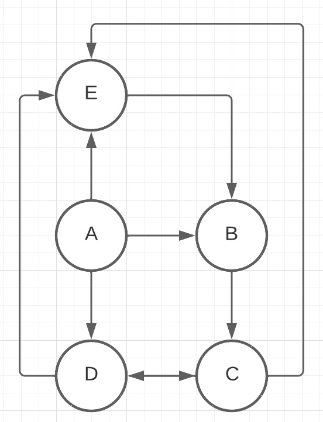
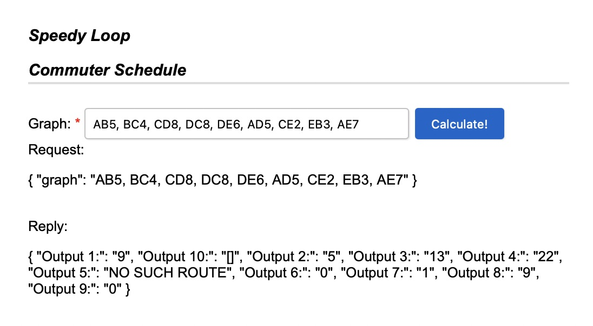

# Directed Graph

Microservice to show how to use directed graphs.  The directed graph will represent the following image:

## Prerequisite 

1) Java 11 installed
2) Gradle installed

## Run

1) Clone repo with 'git clone https://github.com/soaErikNord/schedule.git'
2) With a terminal change directory to schedule using 'cd schedule'
3) Build and run the application using './gradlew bootRun'
4) Open your favorite browser to [http://localhost:8080/api/control-panel/schedule](http://localhost:8080/api/control-panel/schedule)
5) Enter the Graph values and click on the Calculate button.
6) The result will display on the bottom of the page:

## Rules

The following rules have been implemented:

1) The distance of the route A-B-C.
2) The distance of the route A-D.
3) The distance of the route A-D-C.
4) The distance of the route A-E-B-C-D.
5) The distance of the route A-E-D.
6) The number of trips starting at C and ending at C with a maximum of 3 stops. In the sample data below, there are two such trips: C-D-C (2 stops). and C-E-B-C (3 stops).
7) The number of trips starting at A and ending at C with exactly 4 stops. In the sample data below, there are three such trips: A to C (via B,C,D); A to C (via D,C,D); and A to C (via D,E,B).
8) The length of the shortest route (in terms of distance to travel) from A to C.
9) The length of the shortest route (in terms of distance to travel) from B to B.
10) The number of different routes from C to C with a distance of less than 30. In the sample data, the trips are: CDC, CEBC, CEBCDC, CDCEBC, CDEBC, CEBCEBC, CEBCEBCEBC.

